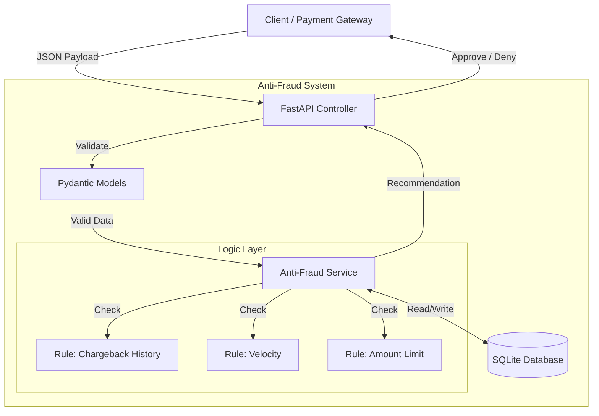

# CloudWalk Software Engineer Test - Answers

## 3.1 - Understand the Industry

### 1. Money and Information Flow

**Information Flow (Authorization):**
1. **Customer**: Inserts card at Merchant.
2. **Merchant**: Sends data to Acquirer.
3. **Acquirer**: Requests authorization from Card Brand.
4. **Card Brand**: Routes to Issuing Bank.
5. **Issuer**: Approves/Denies (Checks balance/fraud).
6. **Response**: Returns to Merchant.

**Money Flow (Settlement):**
1. **Customer**: Pays Issuer (Monthly Bill).
2. **Issuer**: Pays Card Brand (Minus Interchange Fee).
3. **Card Brand**: Pays Acquirer (Minus Brand Fee).
4. **Acquirer**: Pays Merchant (Minus MDR).
5. **Merchant**: Receives net funds.

### 2. Acquirer vs. Sub-acquirer vs. Gateway

| Player | Role | Financial Risk | Touches Money? | Example |
| :--- | :--- | :--- | :--- | :--- |
| **Acquirer** | Brand Licensee | Yes (Full) | Yes | Stone, Cielo |
| **Sub-acquirer** | Intermediary | Yes (Shared) | Yes | PagSeguro |
| **Gateway** | Tech Tunnel | No | No | Stripe (Tech) |

**Flow Impact:**
*   **Sub-acquirer**: Adds a layer. Aggregates multiple merchants under one ID.
*   **Gateway**: Purely technical. Connects Merchant to Acquirer securely.

### 3. Chargebacks vs. Cancellations

**Chargeback (The Enemy):**
*   **Initiator**: Issuer/Customer.
*   **Timing**: Post-settlement (Days/Weeks later).
*   **Reason**: Fraud, dispute, unrecognized purchase.
*   **Result**: Forced reversal + Fines.

**Cancellation (Refund):**
*   **Initiator**: Merchant/Customer.
*   **Timing**: Pre-settlement or voluntary.
*   **Reason**: Mistake, regret, operational error.
*   **Result**: Operational cost only.

**Fraud Connection:**
*   Chargebacks are the main metric for fraud health.
*   High rates (>1%) lead to fines and loss of accreditation (Visa VFMP).

---

## 3.2 - Data Analysis

### 1. Suspicious Patterns Identified

*   **Recidivism**: Users with history of chargebacks returning to transact.
*   **Velocity**: Multiple transactions in seconds (Bot/Script attacks).
*   **High Ticket**: Sudden high-value purchases on new accounts.
*   **Time Anomalies**: Bursts of transactions at unusual hours (e.g., 3 AM).

### 2. Additional Data for Enrichment

*   **Device Fingerprint**: ID, OS, Screen, Battery Level (Hard to fake).
*   **Geolocation**: IP vs. GPS vs. Billing Address distance.
*   **Behavioral Biometrics**: Typing speed, mouse movements.
*   **Social Graph**: Links between Users, Cards, and Devices.
*   **History**: Account age, previous good behavior (Allowlist).

---

## 3.3 - Implemented Solution

### Architecture Overview

*   **API**: Python (FastAPI) - High performance, async.
*   **Database**: SQLite - Simple, relational storage for rules.
*   **Design**: Layered Architecture (API -> Service -> Repository).

### Anti-Fraud Rules (The "Filter Chain")

1.  **Blocklist Check (Critical)**:
    *   *Logic*: If User has ANY previous chargeback -> **DENY**.
    *   *Why*: Proven fraudster.

2.  **Velocity Check (High Frequency)**:
    *   *Logic*: > 3 transactions in 2 minutes -> **DENY**.
    *   *Why*: Stops automated card testing attacks.

3.  **High Value Check (Risk Management)**:
    *   *Logic*: > $1000.00 in 24 hours -> **DENY**.
    *   *Why*: Limits financial exposure on compromised accounts.

### Key Features

*   **Latency**: Optimized queries for <100ms response.
*   **Security**: Input validation (Pydantic) & SQL Injection protection.
*   **Scalability**: Stateless API design.

### Architecture Diagram

---

**Developed by**: Eduardo Kobus  
**Date**: December 2025  
**For**: CloudWalk Software Engineer Challenge
